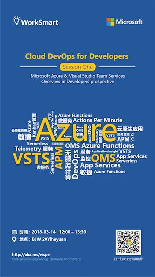

# Cloud DevOps for Developers Trainings

Microsoft Azure is the most developer friendly cloud, it provides many productivity tools and integrations with almost every programming languages and tools. This training program aims help developers to take advantages with Microsoft Azure, Visual Studio Team Services and the IDE/SDKs of your choice to empower developers to be more efficient, productive and customer value driven.

微软云(Microsoft Azure)提供了大量面向开发人员的效率工具，集成方案和各种开发语言/SDK/开发工具的支持。这个培训课程的目标是帮助开发人员充分了解Microsoft Azure, Visual Studio Team Services所提供的各种功能，帮助开发开发人员借助这些工具更加高效的工作，提升生产力并专注于用户价值。

Target audience:

- Developers with Microsoft Azure subscriptions
- Developers with experience of using Microsoft developer tools, e.g. Visual Studio, .Net / .Net Core and Open Source ecosystem supported by Microsoft Azure Platform
- Developers who wants to explore the capabilities of cloud, container and DevOps
- Developers who is interested with Agile Software Development Process and Continuous Delivery

目标学员：

- 有效的Microsoft Azure订阅（全球版）
- 具备使用微软开发工具及平台进行软件开发的实际操作经验，比如：Visual Studio .Net/.Net Core和其他开源工具平台
- 希望对云计算，容器技术和DevOps具备更多了解的开发人员
- 希望对敏捷软件开发和持续交付具备更多了解的开发人员

Schedule: 1.5 hours / session, 1 session/month

规划：每次1.5小时，每月1节课

## Session 1 - Microsoft Azure & Visual Studio Team Services Overview in Developers prospective

Introduce the developer focused features in Microsoft Azure and VSTS, including App Service, Azure Functions, DevTest Labs, DevOps Projects, Resource Manager and Application Insights. The session will be running mainly on demos, showing the capabilities of using VSTS and Visual Studio to build an App to take advantages of above azure features and deliver the code up to the cloud with VSTS release pipeline.

从开发人员的角度针对Azure和VSTS进行介绍，比如：App Service, Azure Function, DevTest Labs, DevOps Projects, 资源管理器和Application Insights. 这个课程将主要采用演示的方式展示如何使用以上功能构建云应用并使用VSTS发布流水线完成自动化持续交付。

The demo will be starting with creating a DevOps Project in Azure Portal, then start feature planning with Agile Backlogs and coding with Visual Studio Code; we will be adding Azure Functions to pull some data from an external REST API and integrate it with the current application. Finally, we will examine the telemetry data collected by Application Insight to finish the whole DevOps cycle.

演示内容包括：

- 使用Azure DevOps Project一键创建完整的云应用代码框架和VSTS发布流水线
- 使用VSTS 敏捷规划Kanban工具管理团队日常工作
- 使用Visual Studio Code完成应用本地编码和调试并通过VSTS发布流水线自动完成云端应用的更新
- 使用Azure Function完成外部API调用开发并集成到当前应用
- 集成Application Insight并通过Azure门户检视用户行为和应用监控数据

Key take-away:

- Understand how Microsoft Azure Platform can help developers to be more efficient
- Abilities to start exploring the features mentioned in the session, e.g. App Services, Azure Functions, DevTest Lab and Application Insights.

主要收获：

- 了解Azure云平台中的开发人员效率工具的能力
- 具备开始使用App Service, Azure Function, DevTest Labs, VSTS和Application Insight开发和运营云端应用的能力

操作手册

- [操作手册](session1/README.md)
- [示例代码](session1/sample-code/README.md)

## Session 2: Deploying and Scaling Micro services with Docker and Kubernetes on Azure

Focus on the new Azure Kubernetes Service (AKS), dive into the details of build, ship and run a Microservices architecture application using Visual Studio, VSTS and AKS. Starting from coding in a Docker for Windows enabled VM as the development workstation backed by DevTest Lab, then we will commit the code into a VSTS git repo and build up the release pipeline to deliver into a AKS cluster environment. Finally, we will run a rolling update triggered by VSTS release pipeline on AKS to show the capabilities of container based cluster.

针对Azure Kubernetes 服务(AKS) 进行深入介绍，通过一个完整微服务应用的调试，构建，发布过程了解如何使用Visual Studio 和 VSTS配合 AKS完成整个微服务应用的DevOps流水线搭建。演示包括：

- 在Azure DevTest Lab中使用虚拟化嵌套支持的Docker for Windows环境作为开发调试机
- 提交代码到VSTS git 代码库并通过Pull Request触发构建和部署流水线，将应用部署到AKS集群环境
- 使用AKS支持的滚动更新确保应用的不停机更新和动态扩容

Key take-away:

- Understanding of capabilities of containers, docker and Kubernetes and how to take advantage of these technologies in daily work
- In depth knowledge of Azure Kubernetes Services (AKS) and how to manage such service in Microsoft Azure

主要收获

- 深入了解如何使用容器，Docker和Kubernetes让开发人员的日常工作更加高效
- 深入了解Azure Kubernetes服务所提供的容器编排能力，具备开始使用AKS部署和运行微服务架构应用的基本能力

## Session 3: Speed up your development with VSTS Continuous Delivery

This session will dive into the development process hosted on VSTS, from Agile Product Backlog management to Sprint planning, then showing how to use VSTS Delivery Plan to integrate multiple teams together on a large scale project. We will also discuss the best practices of using Git branching strategies with Pull Request to enable fast and safe continuous delivery, with VSTS build, Release Management and Azure Resource Manager integration we can prompt our code from dev, test to production environment confidently.

本课程将带你深入了解VSTS所提供的一系列敏捷开发和持续交付支持能力，比如：使用Product Backlog和Sprint Backlog完成日常敏捷开发管理，使用交付计划完成大型项目的跨团队管理，使用Kanban实现拉动式管理，使用Git分支策略和Pull Request确保安全高质量的支持交付代码，使用CI/CD流水线和Azure资源管理器完成代码从开发，测试到生产的一系列环境的自动化部署。

Key take-away:

- Understanding of Agile Software Development Process and how apply such process on top of VSTS
- Understanding of Infrastructure As Code practices and how Azure Resource Manager can help the team to start using such practice
- In depth knowledge of git branching strategies, Pull Request and how to apply such best practices in daily work

主要收益

- 了解如何使用VSTS支持敏捷开发，特别是Scrum和Kanban 方法
- 了解如何在VSTS上利用Azure资源管理器实现基础设施即代码(Infra As Code) 这一DevOps关键实践
- 深入了解VSTS的Git分支策略功能，并借助此功能实现安全高质量的代码持续交付流程

