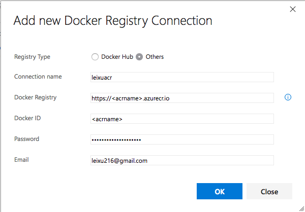

## Session 3: Speed up your development with VSTS Continuous Delivery


This session will dive into the development process hosted on VSTS, from Agile Product Backlog management to Sprint planning, then showing how to use VSTS Delivery Plan to integrate multiple teams together on a large scale project. We will also discuss the best practices of using Git branching strategies with Pull Request to enable fast and safe continuous delivery, with VSTS build, Release Management and Azure Resource Manager integration we can prompt our code from dev, test to production environment confidently.

**Key take-away**

- Understanding of Agile Software Development Process and how apply such process on top of VSTS
- Understanding of Infrastructure As Code practices and how Azure Resource Manager can help the team to start using such practice
- In depth knowledge of git branching strategies, Pull Request and how to apply such best practices in daily work

**Table of Content**

1. Import Sample Code to your VSTS team project
2. Service Endpoints
3. Build Definitions
4. Release Definitions

**Hands-on Lab Instructions**

### Labs 01 - Import Sample Code to your VSTS team project

**Import Sample Code**

Create a new VSTS Project and push voting-azure-devops repo into the project

```bash
cd voting-azure-devops
git remote add vsts {vsts-repo-url}
git push -u vsts master
```

### Labs 02 - Create Service Endpoints

**Add Service Endpoint for ACR**

```bash
## Get ACR loginServer
az acr list --resource-group myResourceGroup
[
  {
    "adminUserEnabled": true,
    "creationDate": "2018-03-31T07:50:47.164637+00:00",
    "id": "/subscriptions/c5a12135-27d6-47fd-a4db-bfbc4e4f5465/resourceGroups/myResourceGroup/providers/Microsoft.ContainerRegistry/registries/leixuacr",
    "location": "eastus",
    "loginServer": "<acrName>.azurecr.io",
    "name": "leixuacr",
    "provisioningState": "Succeeded",
    "resourceGroup": "myResourceGroup",
    "sku": {
      "name": "Basic",
      "tier": "Basic"
    },
    "status": null,
    "storageAccount": null,
    "tags": {},
    "type": "Microsoft.ContainerRegistry/registries"
  }
]

## Get ACR username and password
az acr credential show --name <acrName>
{
  "passwords": [
    {
      "name": "password",
      "value": "{acr-password}"
    },
    {
      "name": "password2",
      "value": "{acr-password}"
    }
  ],
  "username": "leixuacr"
}
```



**Add Service Endpoint for AKS**

Get the AKS API Server Address


Use the following command to get the kubeconfig file content

```bash
cat c:\Users\leixu\.kube\config
```

Copy these information and put into the following form

> Note: add https:// before the API Server Address


### Labs 03 - Build Definition

**Create a Build Definition to build vote, reuslt and worker images and push to ACR**

For each of the image, use Docker Build an Image and Docker Push and Image tasks, set the following parameters

- Docker Registry Connection: use the ACR endpoint
- Action: Build an Image
- Docker file: choose the application's Dockerfile from related folder
- Image Name: <acrName>.azurecr.io/linux/<service-name>: $(Build.BuildId)


- Docker Registry Connection: use the ACR endpoint
- Action: Push an Image
- Image Name: <acrName>.azurecr.io/linux/<service-name>: $(Build.BuildId)


> Note: $(Build.BuildId) will be generated and replaced by VSTS as the Build sequence id, this is used for docker image tags as our versioning control.

### Labs 04 - Release Definition

**Create a Release Defiition to update vote, result and worker images to AKS**

Add 1 environment for the Release Definition, add kubectl task and set the following parameters

- Kubernetes Service Connection: use the Kubernetes service endpoint
- Command: set
- Arguments: image deployment vote vote=leixuacr.azurecr.io/linux/vote:$(Release.Artifacts.voting-CI.BuildId)


Basically this generates the following command

```bash
kubectl image deployment vote vote=leixuacr.azurecr.io/linux/vote:$(Release.Artifacts.voting-CI.BuildId)
```

> Note: (Release.Artifacts.voting-CI.BuildId) will be the artifact BuildID that triggers this release, which is the same version that has been built in the CI. This make sure AKS is updated with the correct image tag.


To be next time ...